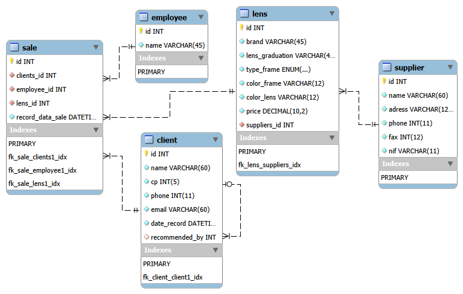
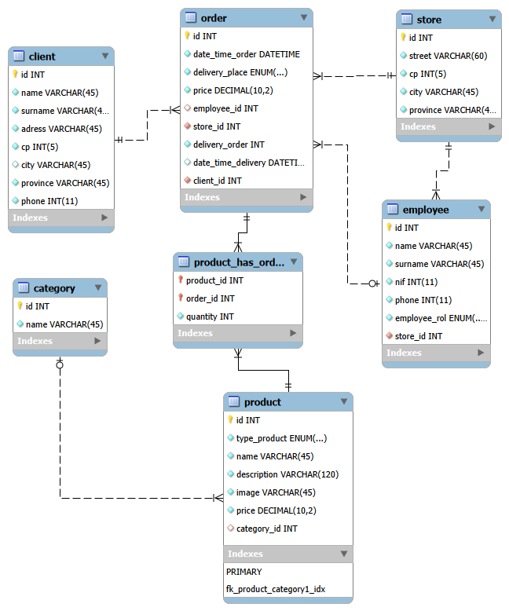

# Sprint 2 — Task 01: Data structure - MySQL

## 📄 Description

This project focuses on the design and implementation of relational databases using MySQL. It includes entity-relationship modeling (EER), database creation, data seeding, and validation through SQL queries.

The goal is to simulate real-world systems by translating business requirements into structured database schemas.

---

## 🎯 Objectives

- Design relational databases from business requirements
- Apply entity-relationship (ER/EER) modeling
- Implement database schemas using SQL
- Populate databases with test data
- Validate relationships and logic through queries

---

## 🛠 Technologies

- MySQL
- Docker (development environment)
- MySQL Workbench

---

## 🧩 Database Design

### 🕶 Optical Store

This model represents an optical store system, including:

- Customers and their personal data
- Suppliers and product sourcing
- Glasses with attributes (brand, frame, lenses, price)
- Employees and sales tracking
- Customer referrals



---

### 🍕 Pizza Store

This model represents an online food ordering system, including:

- Customers and orders
- Products (pizzas, burgers, drinks)
- Product categories
- Stores and employees
- Delivery management



---

## 🧱 Implementation

Each exercise is structured into three SQL scripts:

- **Schema** → database and table creation  
- **Insert** → test data population  
- **Queries** → validation of relationships and business logic  

This separation ensures clarity, maintainability, and reproducibility.

---

## 🚀 How to Run

You can execute the SQL scripts using different methods.

### Option 1 — Command Line (Recommended)

```bash
mysql -u your_user -p < optical_store_schema.sql
mysql -u your_user -p < optical_store_insert.sql
mysql -u your_user -p < optical_store_queries.sql
```

---

### Option 2 — MySQL Client (Workbench or CLI)

```sql
SOURCE optical_store_schema.sql;
SOURCE optical_store_insert.sql;
SOURCE optical_store_queries.sql;
```

👉 Repeat the same process for each exercise.

---

## 📁 Project Structure

```
task-s2-01/
├── level-1/
│   ├── exercise-1/
│   │   ├── eer_optical_store.png
│   │   ├── optical_store_schema.sql
│   │   ├── optical_store_insert.sql
│   │   └── optical_store_queries.sql
│   │
│   └── exercise-2/
│       ├── eer_pizzeria.png
│       ├── pizza_store_schema.sql
│       ├── pizza_store_insert.sql
│       └── pizza_store_queries.sql
│
├── README.md
└── .gitignore
```

---

## ⭐ Exercises

This task includes multiple exercises grouped by difficulty levels:

⭐ **Level 1**  
Basic relational database design and implementation

⭐⭐ **Level 2**  
Advanced modeling (YouTube system)

⭐⭐⭐ **Level 3**  
Complex system design (Spotify)

---

## ✅ Progress

### Level 1

- [x] 1. Optical Store database design and implementation  
- [x] 2. Pizza Store database design and implementation  

### Level 2

- [ ] 1. YouTube database model  

### Level 3

- [ ] 1. Spotify database model  

---

## 🔍 Validation

The database design has been verified through SQL queries that ensure:

- Correct relationships between entities  
- Consistency of inserted data  
- Accurate business logic implementation  

---

## 🧪 Notes

- The database was developed using Docker as a local MySQL environment  
- Docker is optional; scripts can be executed in any MySQL instance  
- EER diagrams were created using MySQL Workbench  
- The project follows a structured approach separating schema, data, and validation  
